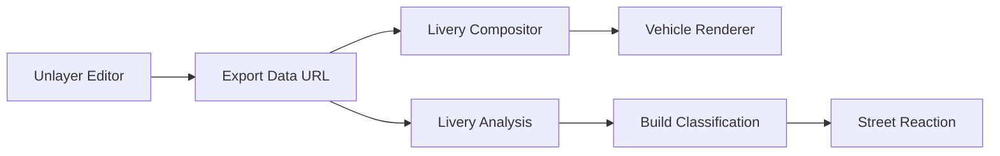

# 01 — Project Overview

## Concept

VICE//CUSTOMS is an original GTA VI-inspired fictional vehicle customization experience. The player walks into a neon-soaked underground garage, picks a ride, designs a livery inside the shop's own paint booth (powered by the Unlayer React Image Editor), and watches their exact artwork get applied to the bodywork. A client-side pixel analysis then classifies the design, and the classification shapes a short cinematic street sequence — quiet builds cruise in peace, loud builds draw police attention.

## Competition Context

Built for the **Unlayer "Build with React Image Editor" Challenge** (2026). The core creative bet is that the image editor itself is the game mechanic:

> The image editor does not sit next to the game — it IS the paint machine.

## Product Goal

Within ~30–45 seconds of opening the site, a judge should be able to:

1. Enter a cinematic garage
2. Select a fictional vehicle
3. Open the paint/livery workstation
4. Create a design in the Unlayer editor
5. Save the image
6. Watch a dramatic reveal sequence
7. See their exact artwork applied to the car
8. Read dynamically calculated style/heat/reputation statistics
9. Take the car onto a short cinematic street sequence
10. Finish on a shareable "build complete" screen

## Core Experience

```text
BOOT
→ GARAGE
→ VEHICLE SELECT
→ PAINT BOOTH
→ REVEAL
→ ANALYSIS
→ STREET RUN
→ FINAL BUILD
```

The core loop:

```text
CREATE → APPLY → ANALYZE → DRIVE
```

## Key Differentiator

The exported image does not sit beside the car — it is **physically composited onto the vehicle body** using a canvas 2D pipeline (body-mask clipping, region transform, curvature shading, specular overlays), and the design's measurable visual character (saturation, complexity, hue) drives fictional world reactions.

## Technology Stack

| Layer | Technology |
|-------|-----------|
| Framework | Next.js 16 (App Router, Turbopack) |
| UI | React 19 + TypeScript |
| Styling | Tailwind CSS v4 |
| Animation | Framer Motion 13 |
| Editor | `@unlayer/react-image-editor` |
| Rendering | HTML Canvas 2D (vehicle compositor, street environment, analysis, build card) |
| Audio | Web Audio API (synthesized, no assets) |
| Icons | lucide-react |
| Persistence | localStorage |

Everything runs client-side. No backend, no database, no accounts, no payments.

## Major Features

- Eight cinematic scenes with a single global state machine
- Three original fictional vehicles (SERAPH R, TEMPEST VX, MARLIN 88) rendered from parametric 2D geometry
- Full Unlayer paint booth with a generated body-graphics template
- Canvas livery compositor (mask → transform → blend → gloss)
- Deterministic image analysis → five build classifications
- Heat-reactive street sequence (scanner feed, police lights, siren)
- Downloadable PNG build card
- Synthesized audio with mute control
- Livery + build number persistence

## Why Unlayer Is Central

Every mechanic depends on the Unlayer editor's output:



Remove Unlayer and the experience collapses: there is no artwork to apply, no analysis input, and no world reaction.

## Non-Goals

- No real driving physics or open world
- No multiplayer, accounts, or backend
- No AI generation
- No NPC system
- No additional image-editing products
- No mission/map/social features
- No true 3D rendering (deliberately; see [Vehicle Rendering](./05-vehicle-rendering.md))