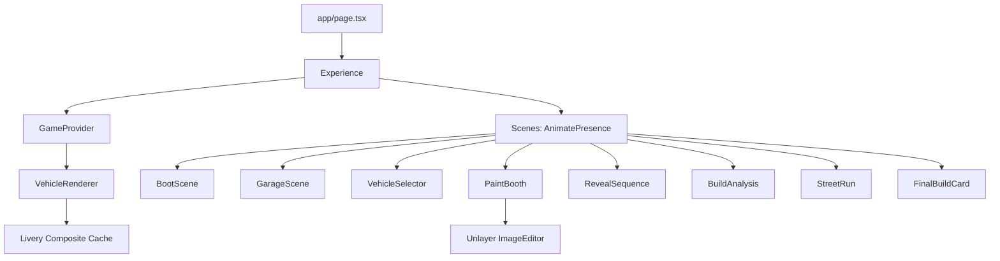
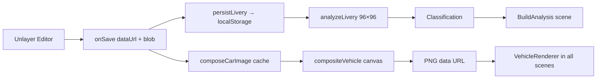

# 02 — Architecture

## Overview

VICE//CUSTOMS is a single-page experience rendered by Next.js App Router. One route (`/`) mounts an `Experience` provider tree; all eight scenes are React components switched by a global state machine. All heavy rendering happens in the browser on HTML Canvas 2D; nothing is rendered on the server except static markup.

## App Router Structure

```text
app/
  layout.tsx          Root layout: fonts, metadata, theme
  page.tsx            Renders <Experience />
  globals.css         Design tokens, utilities, Unlayer chrome overrides
components/
  experience/         Scene components + orchestrator
  vehicle/            VehicleRenderer (displays composited car)
  effects/            FilmGrain, Scanlines, GarageFog, GarageBackdrop, PoliceLights
  ui/                 GameButton, HudPanel, StatBar, RadioSubtitle, CountUp, Clock
lib/
  vehicle/            Parametric profile geometry + per-vehicle config
  livery/             Compositor, analysis, template, composite cache
  game/               Vehicles, classifications/copy, build numbers, GameContext
  sound.ts            Web Audio engine
types/
  game.ts             Scene, VehicleSpec, LiveryAnalysis, BuildState
scripts/              Dev-only verification tooling (not part of the bundle)
```

## Component Hierarchy



## GameContext / State Machine

`lib/game/GameContext.tsx` provides a React context with a `useReducer` state machine:

```ts
type Scene =
  | "boot" | "garage" | "vehicle-select" | "paint-booth"
  | "reveal" | "analysis" | "street-run" | "complete";
```

See [09 — Scene System](./09-scene-system.md) for transitions.

## Livery Pipeline



Pipeline owner: `lib/livery/cache.ts` (async, memoized per vehicle+livery) and `lib/livery/compositor.ts` (the renderer itself).

## Image Analysis Pipeline

```mermaid
flowchart LR
    A[dataUrl] --> B[load Image]
    B --> C[96×96 downsample, no smoothing]
    C --> D[getImageData]
    D --> E[metrics: saturation, brightness, contrast, complexity, colorfulness, hue]
    E --> F[scoring formulas]
    F --> G[STYLE / STREET REP / SUBTLETY / POLICE HEAT]
    F --> H[classify → Ghost Spec | Street Clean | Vice Classic | Heat Magnet | Full Chaos]
```

## Audio Engine

`lib/sound.ts` — a singleton Web Audio engine. All effects are synthesized (oscillators + filtered noise). No audio files. The context is created lazily on the first user gesture and gated by a mute flag. See [10 — Audio System](./10-audio-system.md).

## Persistence

`lib/game/buildNumber.ts` manages `localStorage` keys:

| Key | Purpose |
|-----|---------|
| `vc-build-number` | Incrementing build counter |
| `vc-last-livery` | Last exported livery data URL |

## Asset Structure

- `public/` — only the favicon; there are no image assets
- Vehicle art, street environments, the build card, and the analysis input are all **generated at runtime on canvas**
- The only external asset dependency is the Unlayer editor's CDN script (see [08 — Unlayer Integration](./08-unlayer-integration.md))